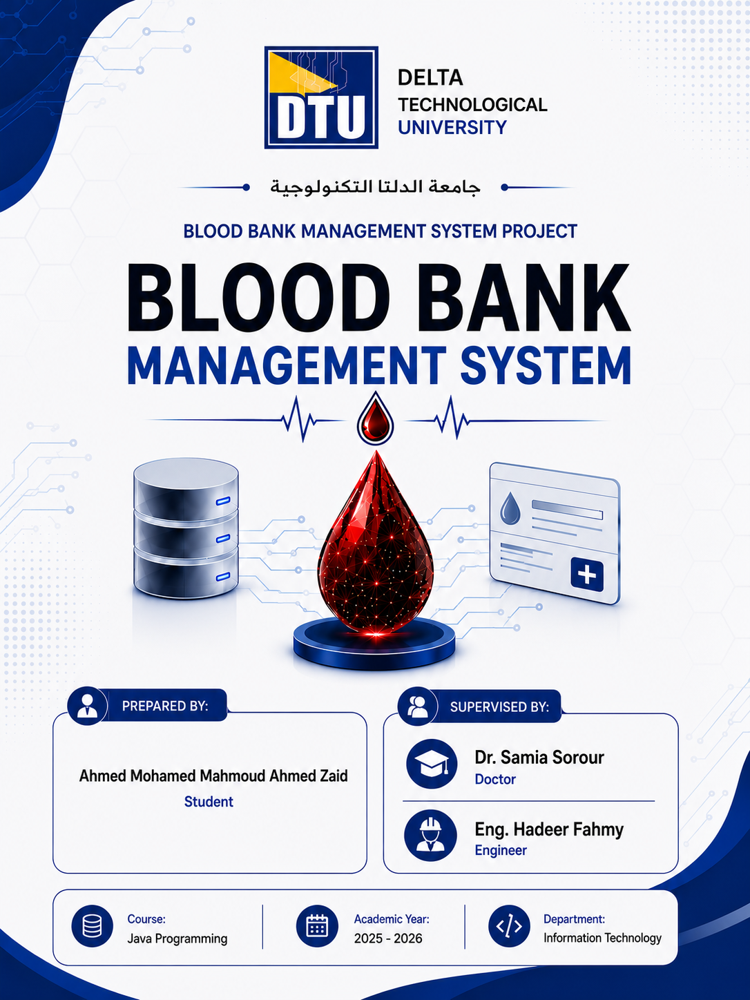

# 🩸 Blood Bank Management System

A Java-based system for managing blood bank operations efficiently using Object-Oriented Programming concepts.

---

## 📌 Project Features
- Add Donors
- Manage Patients
- Blood Donation Management
- Blood Request Handling
- Store Data Using Text Files
- Search and Display Records

---

## 💻 Technologies Used
- Java
- OOP
- Encapsulation
- Inheritance
- Arrays
- Loops
- Switch Statements
- If Conditions

---

## 🧠 OOP Concepts Used
- Classes & Objects
- Encapsulation
- Inheritance

---

## 📂 Files Included
- Java Source Files
- Text Files for Data Storage
- Management Classes

---

## 🚀 Purpose of the Project
This project helps blood banks and hospitals manage blood donations and patient requests efficiently and accurately.

---

## 👨‍💻 Developed By
Ahmed Mohamed Mahmoud Ahmed Zaid  
Delta Technological University
